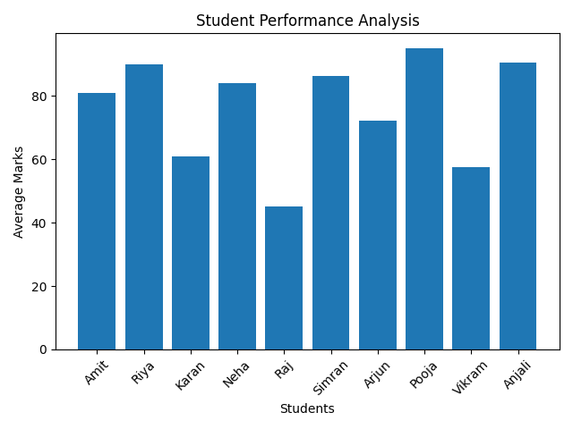

# Student Performance Analyzer

A Python-based project for analyzing student performance using data processing and visualization techniques.

## Features
- Calculates average marks
- Identifies top-performing students
- Detects weak students
- Visualizes performance using graphs

## Tech Stack
- Python
- Pandas
- Matplotlib

## Output

## Project Purpose
This project demonstrates practical use of data analysis, structured programming, and visualization in an educational context.

## Future Scope
- Real-time data integration
- Dashboard visualization
- Scalable data pipelines
